<div align="center">


<h1>Waste Reduction Automation</h1>

<p><strong>The Strategic Foundation for Enterprise Cloud Efficiency, Automated Waste Detection, and Sustainability Optimization.</strong></p>

[]()
[]()
[]()

<br/>

> **"Efficiency is the ultimate sustainability strategy."** 
> **Waste Reduction Automation** is an enterprise-grade platform designed to provide a secure, measurable, and highly automated foundation for global cloud resource optimization. It orchestrates the complex lifecycle of waste management—from multi-cloud resource discovery and automated idle-compute detection to real-time remediation execution and carbon impact estimation.

</div>

---

## 🏛️ Executive Summary

Unused and overprovisioned cloud resources are strategic financial and environmental liabilities; lack of automated remediation is a primary driver of cost overruns. Organizations fail to optimize their infrastructure not because of a lack of metrics, but because of fragmented detection standards, lack of automated cleanup workflows, and an inability to model ROI with operational precision.

This platform provides the **Cloud Efficiency Plane**. It implements a complete **Enterprise Optimization-as-Code Framework**, enabling FinOps and Engineering teams to manage cloud waste as a first-class citizen. By automating the discovery of "zombie" resources and orchestrating real-time remediation policies, we ensure that every organizational asset—from VMs to load balancers—is right-sized by default, audited for history, and strictly aligned with institutional sustainability goals.

---

## 📐 Architecture Storytelling: Principal Reference Models

### 1. Principal Architecture: Global Waste Reduction Automation & FinOps Control Plane
This diagram illustrates the end-to-end flow from multi-cloud resource discovery and utilization analysis to automated remediation, ROI modeling, and institutional efficiency auditing.

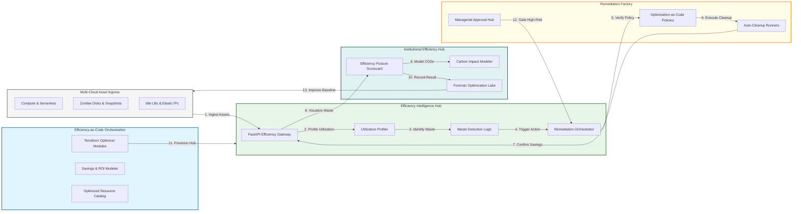

### 2. The Waste Lifecycle Flow
The continuous path of a cloud resource from initial discovery and detection to active analysis, approval, remediation, and forensic auditing.

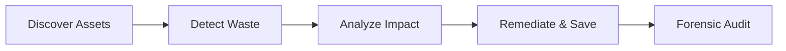

### 3. Idle Compute & Storage Discovery Engine
How the system identifies unattached storage volumes, idle virtual machines, and "zombie" snapshots across global regions using high-fidelity utilization signals.

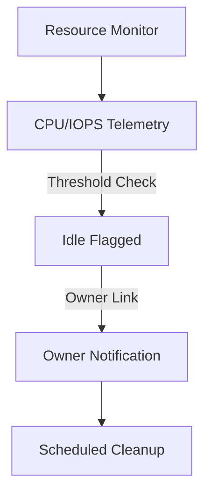

### 4. Automated Remediation Workflow (Self-Healing)
Orchestrating safe cleanup actions by distinguishing between low-confidence detections (alert only) and high-confidence waste (auto-remediation).

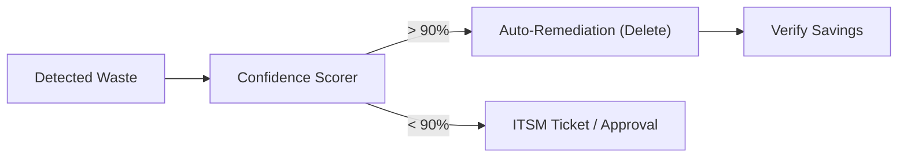

### 5. Multi-Cloud Resource Inventory Mesh
Mapping and indexing organizational assets across AWS, Azure, and GCP into a unified inventory to ensure total visibility into the global efficiency posture.

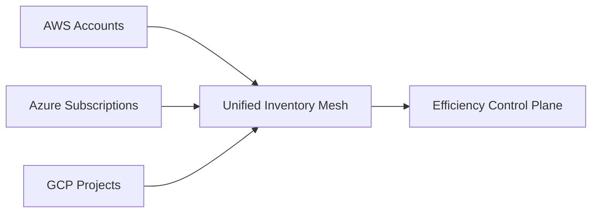

### 6. FinOps ROI & Savings Modeler
Calculating the realized financial benefit of specific cleanup actions, including immediate cost avoidance and long-term projected savings.

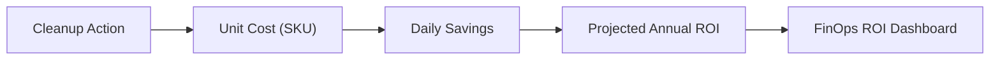

### 7. Sustainability & Carbon Impact Flow
Converting energy savings from decommissioned compute and storage into measurable CO2e reduction metrics for institutional environmental reporting.

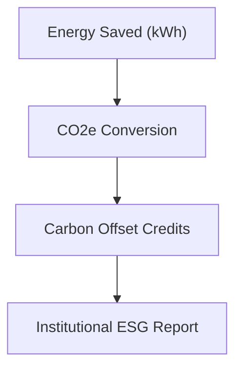

### 8. Institutional Efficiency Scorecard
Grading organizational performance based on key indicators: Waste Density, Remediation Velocity, and Sustainability Impact.

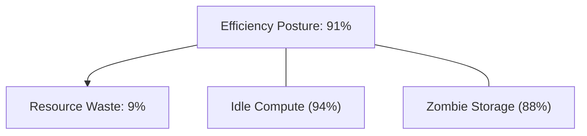

### 9. Identity & RBAC for Optimization Ops
Managing fine-grained access to optimization data, remediation triggers, and policy settings between Optimization Leads, Auditors, and Resource Owners.

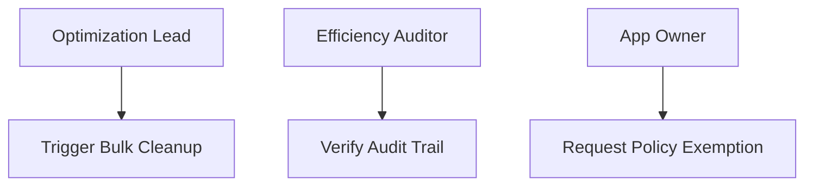

### 10. IaC Deployment: Efficiency-as-Code Framework
Using Terraform to deploy and manage the versioned distribution of the efficiency hubs, detection workers, and forensic optimization lakes.

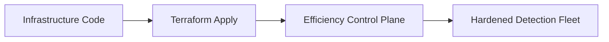

### 11. Metadata Lake for Forensic Optimization Audit
Storing long-term records of every discovery event, remediation action, and realized saving for institutional investigation and compliance.

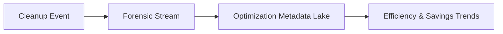

---

## 🏛️ Core Efficiency Pillars

1.  **Unified Waste Visibility**: Centralizing the discovery of idle resources across multi-cloud environments.
2.  **Automated Remediation**: Moving from "advisory" metrics to "actionable" auto-cleanup workflows.
3.  **Sustainability Integration**: Directly linking resource optimization to corporate carbon reduction goals.
4.  **Policy-Based Governance**: Defining efficiency standards as versioned code that enforces organizational intent.
5.  **FinOps ROI Attribution**: Measuring the exact financial impact of every decommissioned or resized asset.
6.  **Full Auditability**: Immutable recording of every optimization action for institutional record-keeping.

---

## 🛠️ Technical Stack & Implementation

### Efficiency Engine & APIs
*   **Framework**: Python 3.11+ / FastAPI.
*   **Detection Core**: High-performance engine for evaluating resource utilization (CPU, RAM, Disk IO).
*   **Remediation Factory**: Modular workers for executing safe cleanup actions across cloud provider APIs.
*   **Sustainability Modeler**: Advanced conversion logic for energy-to-carbon impact estimation.
*   **State Management**: PostgreSQL (Metadata Lake) and Redis (Execution Cache).

### Efficiency Dashboard (UI)
*   **Framework**: React 18 / Vite.
*   **Theme**: Emerald, Amber, Slate (Modern FinOps & Sustainability aesthetic).
*   **Visualization**: Recharts for savings trends, waste heatmaps, and remediation success rates.

### Infrastructure & DevOps
*   **Runtime**: AWS EKS or Azure Kubernetes Service (AKS).
*   **Connectivity**: Cross-cloud API integration with least-privilege IAM and Service Principals.
*   **IaC**: Modular Terraform for deploying the efficiency hub and detection worker fleet.

---

## 🏗️ IaC Mapping (Module Structure)

| Module | Purpose | Real Services |
| :--- | :--- | :--- |
| **`infrastructure/eff_hub`** | Central management plane | EKS, PostgreSQL, Redis |
| **`infrastructure/workers`** | Distributed detection fleet | Lambda, EventBridge |
| **`infrastructure/governance`** | Optimization-as-Code policies | OPA, Policy Agent |
| **`infrastructure/auditing`** | Forensic optimization sinks | S3, Athena, Quicksight |

---

## 🚀 Deployment Guide

### Local Principal Environment
```bash
# Clone the efficiency platform
git clone https://github.com/devopstrio/waste-reduction-automation.git
cd waste-reduction-automation

# Configure environment
cp .env.example .env

# Launch the Efficiency stack
make up

# Trigger a mock waste detection and remediation simulation
make simulate-cleanup
```

Access the Efficiency Dashboard at `http://localhost:3000`.

---

## 📜 License
Distributed under the MIT License. See `LICENSE` for more information.

---
<div align="center">
  <p>© 2026 Devopstrio. All rights reserved.</p>
</div>
