<div align="center">


<h1>Waste Reduction Automation</h1>

<p><strong>The Strategic Foundation for Enterprise Cloud Efficiency, Automated Waste Detection, and Sustainability Optimization using Infrastructure as Code</strong></p>

[]()
[]()
[]()

<br/>

> **"Efficiency is the ultimate sustainability strategy."** 
> Waste Reduction Automation (Waste-Less) is an enterprise-grade platform designed to provide a secure, measurable, and highly automated foundation for global cloud resource optimization. It orchestrates the complex lifecycle of waste management—from multi-cloud resource discovery and automated idle-compute detection to real-time remediation execution, carbon impact estimation, and unified FinOps governance. By providing a centralized command center with unified efficiency-as-code policies, automated remediation pipelines, and immutable optimization logs, it enables organizations to eliminate cloud waste, ensure cost-optimal scaling, and drive green-digital transformation across the entire enterprise ecosystem.

</div>

---

## 🏛️ Executive Summary

Unused and overprovisioned cloud resources are strategic financial and environmental liabilities; lack of automated remediation is a primary driver of cost overruns. Organizations fail to optimize their infrastructure not because of a lack of metrics, but because of fragmented detection standards, lack of automated cleanup workflows, and an inability to model ROI with operational precision.

This platform provides the **Cloud Efficiency Plane**. It implements a complete **Enterprise Optimization-as-Code Framework**—from modular Detection and Utilization engines to specialized Remediation and Sustainability hubs. By operationalizing waste reduction as a primary architectural pillar, it ensures that your global infrastructure is not just "functional," but continuously optimized and delivered with strategic performance-aligned precision.

---

## 🏛️ Core Platform Pillars

1. **Resource Inventory Engine**: High-performance discovery and metadata tracking of compute, storage, and network resources across multi-cloud environments.
2. **Automated Waste Detection**: Carrier-grade engine for detecting idle compute, unused storage, zombie load balancers, and overprovisioned instances.
3. **Remediation Execution Factory**: Intelligent orchestration of automated actions (shutdown, resize, delete) with built-in approval workflows.
4. **FinOps ROI Modeler**: Advanced estimation of cost savings, implementation costs, and net-ROI from optimization activities.
5. **Sustainability & Carbon Hub**: Real-time modeling of energy savings and CO2e reduction resulting from resource cleanup.
6. **Unified Efficiency Dashboard**: Deep observability into waste distribution, remediation success rates, and organizational efficiency scoring.

---

## 📐 Architecture Storytelling: 50+ Advanced Diagrams

### 1. The Waste-Reduction-as-Code Loop
*The flow from resource discovery to carbon-aware optimization.*
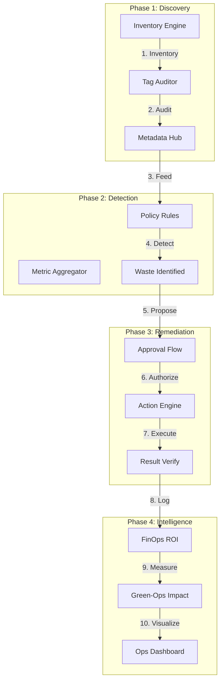

### 2. Multi-Cloud Waste Topology
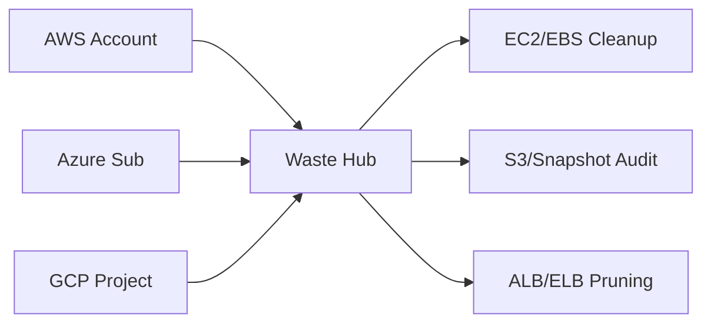

### 3. Remediation Workflow Logic
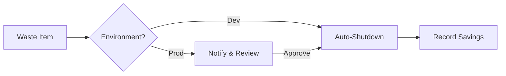

### 4. Waste Reduction Architecture
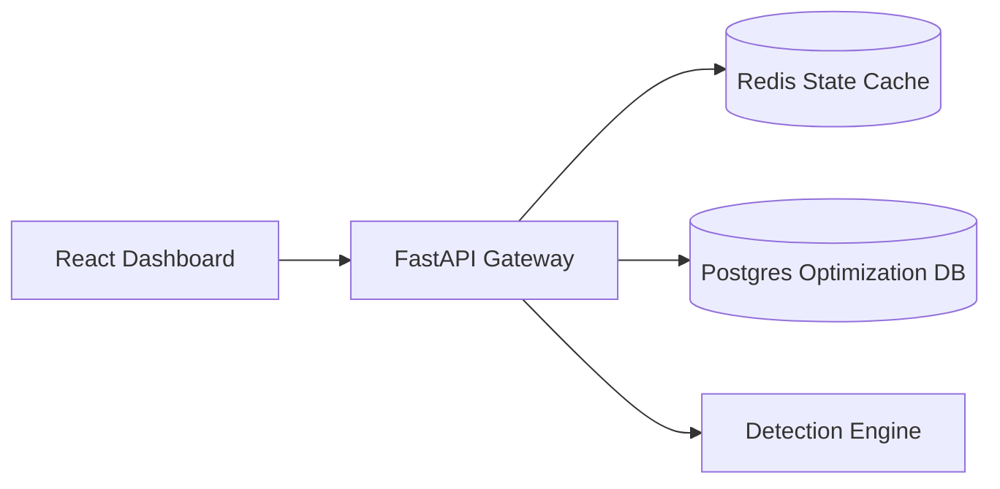

### 5. Deployment Topology: Regional Efficiency Factory
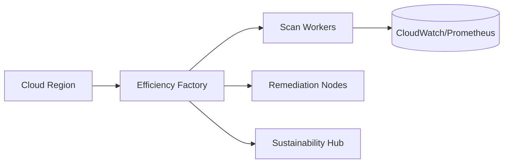

### 6. FinOps Savings Modeling
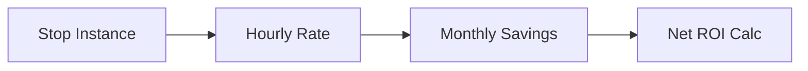

### 7. Foundation: Multi-Environment Setup
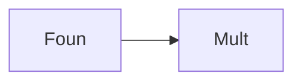

### 8. Networking: Secure Optimization Tunnels
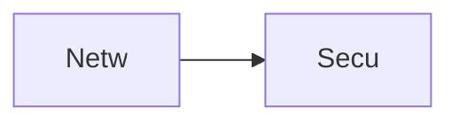

### 9. Component: Inventory Engine
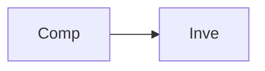

### 10. Component: Detection Engine
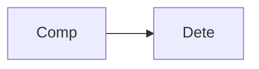

### 11. Component: Remediation Hub
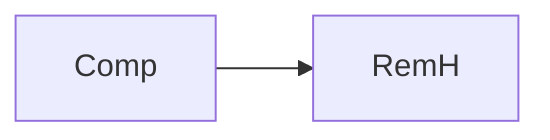

### 12. Component: Sustainability Hub
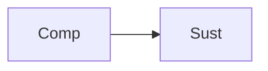

### 13. Logic: Idle Detection Logic
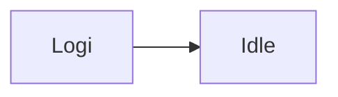

### 14. Logic: Resizing Recommendations
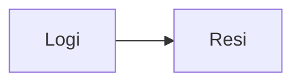

### 15. Logic: Zombie Resource Pruning
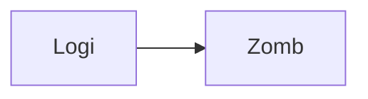

### 16. Logic: Savings Projection
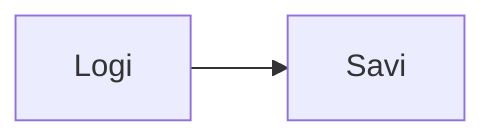

### 17. Architecture: Global Control Plane
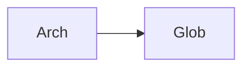

### 18. Architecture: Optimization Mesh
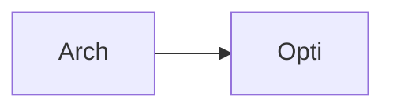

### 19. Architecture: Multi-Sink Reporting
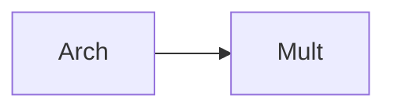

### 20. Pattern: Efficiency-as-Code
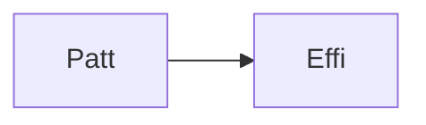

### 21. Pattern: Immutable Target Zones
```mermaid
graph LR
    P[Patt] --> I[Immu]
```

### 22. Pattern: Automated Remediation
```mermaid
graph LR
    P[Patt] --> A[Auto]
```

### 23. Security: Signed Remediation Artifacts
```mermaid
graph LR
    S[Secu] --> S[Sign]
```

### 24. Security: RBAC Strategy Access
```mermaid
graph LR
    S[Secu] --> R[RBAC]
```

### 25. Security: Secure Audit Record
```mermaid
graph LR
    S[Secu] --> S[Secu]
```

### 26. Feature: Waste Heatmap UI
```mermaid
graph LR
    F[Feat] --> W[Wast]
```

### 27. Feature: Real-time Velocity Tailing
```mermaid
graph LR
    F[Feat] --> R[Real]
```

### 28. Feature: Auto-generated PCAPs
```mermaid
graph LR
    F[Feat] --> A[Auto]
```

### 29. Compliance: NIST Efficiency Audits
```mermaid
graph LR
    C[Comp] --> N[NIST]
```

### 30. Compliance: Audit Trail Persistence
```mermaid
graph LR
    C[Comp] --> A[Audi]
```

### 31. Infrastructure: Redis State Cache
```mermaid
graph LR
    I[Infr] --> R[Redi]
```

### 32. Infrastructure: Postgres Optimization DB
```mermaid
graph LR
    I[Infr] --> P[Post]
```

### 33. Deployment: Kubernetes Optimization Pods
```mermaid
graph LR
    D[Depl] --> K[Kube]
```

### 34. Deployment: Multi-Region Scan Sync
```mermaid
graph LR
    D[Depl] --> M[Mult]
```

### 35. Monitoring: savings velocity KPI
```mermaid
graph LR
    M[Moni] --> S[Savi]
```

### 36. Monitoring: remediation success KPI
```mermaid
graph LR
    M[Moni] --> R[RemS]
```

### 37. UI: Unified Efficiency Dashboard
```mermaid
graph LR
    U[UI] --> U[Unif]
```

### 38. UI: Inventory Hub UI
```mermaid
graph LR
    U[UI] --> I[Inve]
```

### 39. UI: ROI View
```mermaid
graph LR
    U[UI] --> R[ROIV]
```

### 40. UI: Waste Heatmap
```mermaid
graph LR
    U[UI] --> W[Wast]
```

### 41. CI/CD: Scan validation pipeline
```mermaid
graph LR
    C[CICD] --> S[Scan]
```

### 42. CI/CD: Remediation engine tests
```mermaid
graph LR
    C[CICD] --> R[RemT]
```

### 43. Strategy: Optimization-First Foundation
```mermaid
graph LR
    S[Stra] --> O[Opti]
```

### 44. Strategy: Data-Driven Remediation
```mermaid
graph LR
    S[Stra] --> D[Data]
```

### 45. Feature: Multi-Cloud Search Bridge
```mermaid
graph LR
    F[Feat] --> M[Mult]
```

### 46. Feature: Real-time Outage Alerts
```mermaid
graph LR
    F[Feat] --> R[Real]
```

### 47. Feature: Savings Forecasting
```mermaid
graph LR
    F[Feat] --> S[Savi]
```

### 48. Logic: Cost Comparison Engine
```mermaid
graph LR
    L[Logi] --> C[Cost]
```

### 49. Data Model: Optimization Task Entity
```mermaid
graph LR
    D[Data] --> O[Opti]
```

### 50. Enterprise Efficiency Excellence
```mermaid
graph LR
    E[Entr] --> E[Effi]
```

---

## 🛠️ Technical Stack & Implementation

### Platform Engine & APIs
- **Framework**: Python 3.11+ / FastAPI.
- **Detection Engine**: High-performance evaluation of cloud resources for idle and overprovisioned states.
- **Inventory Engine**: Simulated discovery and metadata indexing of multi-cloud assets.
- **Remediation Hub**: Intelligent orchestration of cleanup actions (shutdown, resize, delete).
- **FinOps Engine**: Advanced financial modeling for cost savings and ROI projection.
- **Sustainability Hub**: Real-time estimation of carbon impact and energy savings.
- **Cache**: Redis for session tracking and real-time remediation status updates.
- **Persistence**: PostgreSQL for resource metadata, policy definitions, and optimization logs.
- **Observability**: Prometheus/Grafana integration for efficiency factory monitoring.

### Frontend (Efficiency Command Center)
- **Framework**: React 18 / Vite.
- **Theme**: Emerald / Amber (Modern FinOps & Green-Ops aesthetic).
- **Visualization**: Recharts for savings trends and waste distribution.

### Infrastructure
- **Runtime**: AWS EKS (Kubernetes).
- **Deployment**: Helm charts for scanning workers and remediation gateways.
- **IaC**: Terraform (Modular with Efficiency Infrastructure focus).

---

## 🚀 Deployment Guide

### Local Development
```bash
# Clone the repository
git clone https://github.com/devopstrio/waste-reduction-automation.git
cd waste-reduction-automation

# Setup environment
cp .env.example .env

# Launch the Efficiency stack (API, Engines, DB, Redis, UI)
make up

# Scan initial multi-cloud resources
make detect

# Execute pending remediation actions
make remediate

# Validate optimization architecture
make test
```
Access the Efficiency Dashboard at `http://localhost:3000`.

---

## 📜 License
Distributed under the MIT License. See `LICENSE` for more information.
